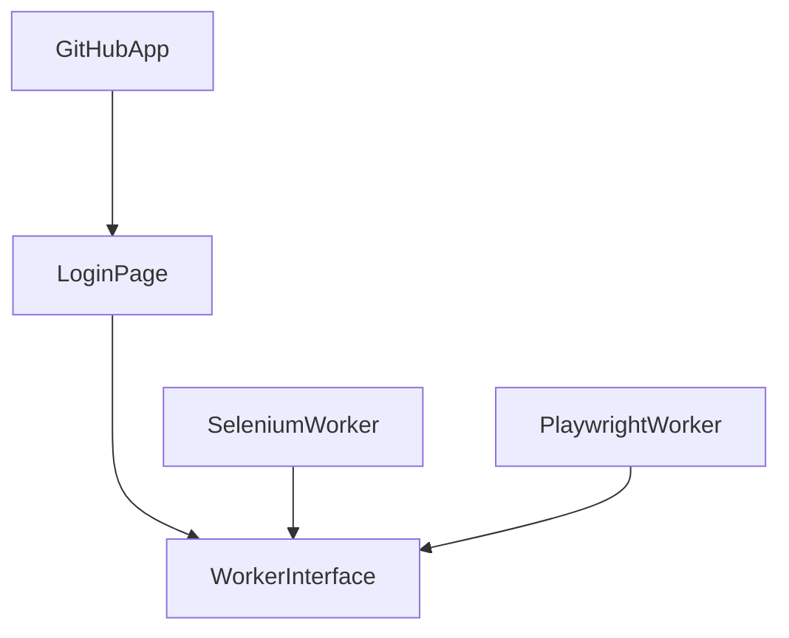
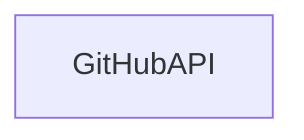

# Description

This is an educational project owned by Weronika Strzelczyk. It is in development, during Python Academy GlobalLogic in 2024. 

It contains 3 tests:
* UI tests - for *github.com* negative login trial
    * 1 test in selenium 
    * 1 test in playwright 
* API tests - for *api.github.com* repository query test

## How to set up the environment locally

### What is needed:
- Python version 3.11.7
- Poetry version 1.8.2

### How to install dependencies

 `poetry install`

`poetry run playwright install` - required for playwright browser managers

### How to run
To run tests: `poetry run pytest`

### Development
Install and run pre-commit locally before each new commit: `pre-commit run --all-files`

## Structure of framework

* [src](./src)
    * [api](./src/api)
        * Github API controller
    * [ui](./src/ui)
        * [pages](./src/ui/pages)
            * Page object models of github.com
        * [git_hub_app](./src/ui/git_hub_app.py) - Github UI app controller
* [tests](./tests)
   * [test_api](./tests/test_api)
        * API tests 
   * [test_ui](./tests/test_ui)
        * User Interface tests
   
 
* [workers](./workers)
    * Interfaces' implementation of given frameworks for UI

### What to exclude in .gitignore
* /reports

## Structure of project
### UI testing

### API testing

